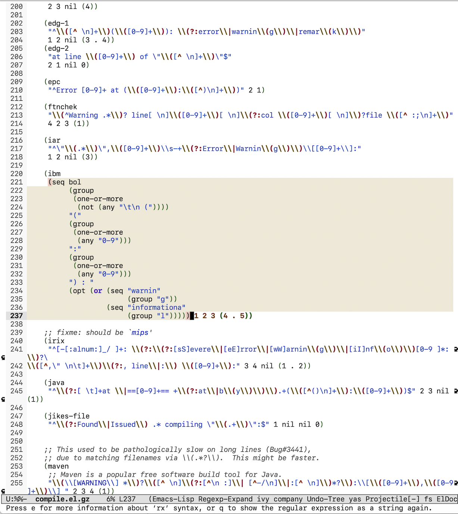

# regexp-expand
Show the ELisp regular expression at point in rx form.

## Installation

Clone this repository and add it to your Emacs `load-path`:

```elisp
(add-to-list 'load-path "<Path to regexp-expand directory>")
```

This program autoloads a command, `regexp-expand`, that, when the point is inside a string, will replace it inline with an equivalent and much more readable `rx` form of the same regular expression.

## Screenshot


