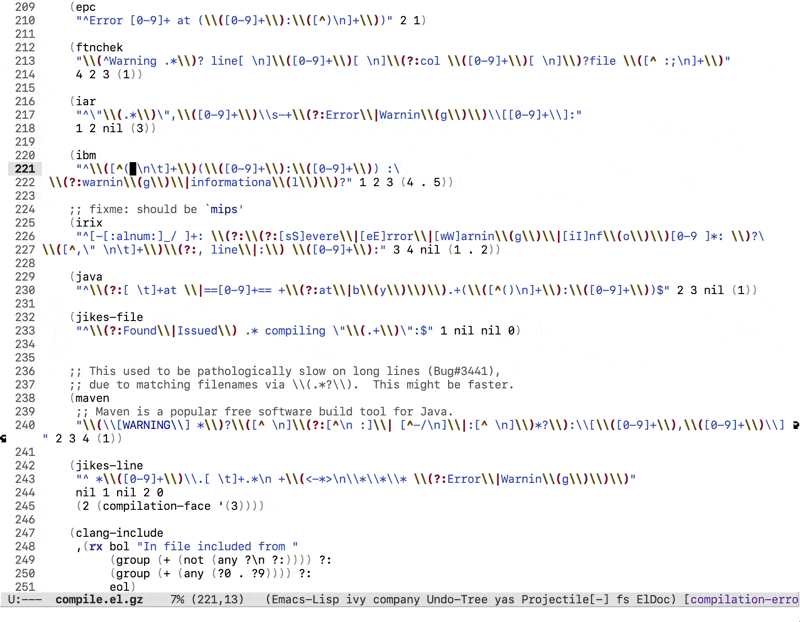

# regexp-expand
Show the ELisp regular expression at point in `rx` form.

## Installation

This package requires `xr`, which is available in ELPA/MELPA: `M-x package-install RET xr RET`

Then, clone this repository to your local machine and add the following to your initialization file:

```elisp
(add-to-list 'load-path "<Path to regexp-expand directory>")
(require 'regexp-expand)
```

The main entry point of this package is `regexp-expand`, a command that, when the point is inside a regular expression, will replace it temporarily with an equivalent but much more readable `rx` form.

## Demonstration


